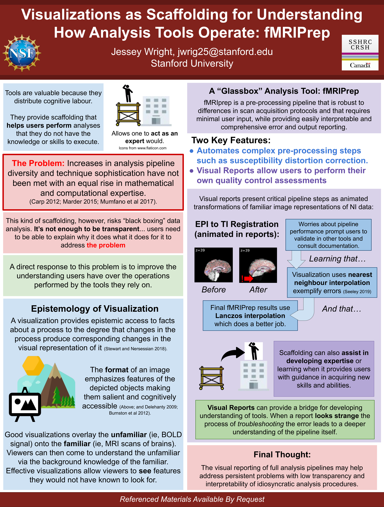

name: inverse
layout: true
class: center, middle, inverse
---
# *dMRIPrep* Sprint
## Seattle 2020
### O. Esteban
###### [oesteban.github.io/dmriprep-sprint](https://oesteban.github.io/dmriprep-sprint)
---
layout: true
class: middle, inverse
---
## Origins: the *fMRIPrep* case and the *NiPreps* framework

* The neuroimaging workflow involves a large chain of processing and analysis steps

  * While analysis is highly dependent on the data and research question...
  * ... preprocessing can be abstracted and generalized across analyses.

* The *fMRIPrep* experience revealed the appetite for a tool that:

  * provides analysis-grade data quality;
  * with minimal intervention; and
  * with maximal transparency.

### The vision for NiPreps is to provide end-users (i.e., researchers) with applications that allow them to perform quality control smoothly and to prepare their data for modeling and statistical analysis.
* See doi:[10.31219/osf.io/ujxp6](https://doi.org/10.31219/osf.io/ujxp6)
---
## Elements of the NiPreps framework
1. Software infrastructure + Nipype wrapping of third-party tools
2. Middleware utilities and services
3. End-user tools
---
layout: true
---

---
layout: true
class: middle, inverse
---
## Driving principles for the end-user tools
1. *NiPreps* only and fully support BIDS and BIDS-Derivatives for the input and output data.

2. *NiPreps* are packaged as a fully-compliant [BIDS-App](https://bids-apps.github.io), not just in its user interface, but also in the continuous integration, testing, and delivery.

3. The scope of *NiPreps* is strictly limited to preprocessing tasks.

4. *NiPreps* are agnostic to subsequent analysis, i.e., any software supporting BIDS-Derivatives for its inputs should be amenable to analyze data preprocessed with them.

5. *NiPreps* are thoroughly and transparently documented (including the generation of individual, visual reports with a consistent format that serve as scaffolds for understanding the underpinnings and design decisions).

6. *NiPreps* are community-driven, and contributors (in any sense) always get credited with authorship within relevant publications.

7. *NiPreps* are modular, reliant on widely-used tools such as AFNI, ANTs, FreeSurfer, FSL, NiLearn, or DIPY  and extensible via plug-ins.
---
## Robust, generic DWI preprocessing
* Adapts the workflow to the actual data available (via BIDS)

* Minimal requirements:
  * At least one T1w and one DWI run
  * Data must be [BIDS-Compliant](https://bids-standard.github.io/bids-validator/)

## Community-driven, and adhered to modern CS and software engineering standards

* *dMRIPrep* is a [BIDS-App](https://bids-apps.github.io)

## Self-documenting

* *dMRIPrep* generates reports that allow you to detect issues in
  preprocessing
---
layout: true
---

---

---
layout: true
class: middle, inverse
---
## Reports as Scaffolds for Expertise

.pull-left[

]

.pull-right[

.distribute[
*dMRIPrep* generates one participant-wide report
after execution, providing .blue[visual support to look inside the box].

.large[Reports are a crucial element to ensure transparency.]
]
]
---
## Sprint organization

### Agenda

  * https://hackmd.io/gs57jc7xReK8snxBOuzSBw?both

### Communication via Mattermost:

  * https://mattermost.brainhack.org/brainhack/channels/dmriprep

### We will exercise:

  * Python
  * Git + GitHub
  * Nipype
  * PyBIDS

---
## Sprint organization

### Objectives

  * Set-up a common framework for development (tests, documentation, etc.s)

  * Discuss the details of several steps of dMRI preprocessing. E.g.:

    * Sequences split by runs ([#43])
    * How to schedule their concatenation ([#27])
    * Eddy-Current correction

  * Finalize ongoing PRs ([#25], [#29])

  * Recover relevant sections (e.g., HMC reports) from legacy version
---
## Agenda: Tasks

(from the [Shared Document])

1. **B0 reference of each `run-` & brain extraction from that** ([#25]): finalize (if not done before the workshop).
    * Grand mean scaling? (working on this on NiWorkflows right now) - write parameters to correct for signal drift down the line?
1. **Concatenating different `run-`** ([#43]): conclude discussion and get a first implementation merged
    * Revisit/revise [#27].
1. **Data conformity checks** ([#24]):
    * What conformity checks were not addressed by [#26]?
    * What other conformity checks are needed (e.g., NIfTI x-forms)?
    * Implementation
    * Push [Matt's PR to BIDS about b-matrix](https://github.com/bids-standard/bids-specification/pull/352) to an end
1. **Head-motion estimation & reportlet**: depending on the design decisions made for [#43]:
    * implement a head-motion parameters estimation workflow (or reuse from NiWorkflows),
    * rotate b-matrix,
    * generate a reportlet with Anisha's visualization of HMC, and
    * generate FD series for downstream outlier rejection
1. **SDCFlows** (= susceptibility-derived distortion correction and related issues) - [project](https://github.com/poldracklab/sdcflows)/
    * Finalize TOPUP implementation [poldracklab/sdcflows#76] - which includes generating the topup/eddy index file.
    * Connect SDCFlows as it is done in fMRIPrep (i.e., enable SDC).
---
## Agenda: Tasks (continued)

(from the [Shared Document])

6. **Open discussions about Eddy Current Correction (ECC)**
    * to FSL `eddy` or not to `eddy`?
7. **B1 nonuniformity**
    * Extract from sMRIPrep (estimated on the T1w)
    * Can it be applied in the beginning?
8. **Repository maintenance**
    * Unlink nipy/dmriprep
    * Increase code coverage (i.e., write tests for existing code)
    * Start with documentation
---
## Schedule & methodology
.pull-left[
### Day 1:
    9.00 Touch-base / round table
      * Driving principles of NiPreps / dMRIPrep (OE)
      * Open discussions regarding CONTRIBUTING.md, if necessary.
    10.00 Back-to-back groups (two/three people working on one item of those above)
    12.00 Lunch break
    16.00 Individual PR revision
    16.30 Group PR revision
]
.pull-right[
### Day 2:
    9.30 Round table
    10.00 Focus: reportlets (OE & MJ)
      * How to generate them
      * The report generation factory of NiWorkflows
    10.30 Back-to-back groups (tasks)
    12.00 Lunch break
    13.00 Back-to-back groups (DOCUMENTATION)
    16.00 Individual PR revision
    16.30 Group PR revision

### Day 3:
    9.30 Focus: the release process and unit-testing (OE & DP)
    10.30 PR Merge festival and conflict resolution group
    12.00 Lunch break
    13.00 Round table and plans (e.g., plugins)
]
---
## Low hanging fruits & potential objectives feasible in the short term

1. Finalizing run-wise average b=0 and brain-mask

2. Finalizing conversation about acquisition divided by runs

3. Finalizing integration of TOPUP in SDCFlows

4. Encapsulate HMC reports as a reportlet

5. "Predicting" BIDS outputs

6. Maintenance, housekeeping and communication:
  - Start documentation sections
  - Strategy for testing with the goal of increasing coverage fast
  - Finalize nice-looking workflow graph
  - Set grounds for a community paper

7. Monitoring users with Google Analytics
---
## By joining the *dMRIPrep* project, you are signing for...

(based on the experience of *fMRIPrep*)

### The bright side

  * A fast-growing community of experts which makes it easier to reach the best solutions
  * Learn a lot about Python, CS and SW engineering
  * Scientific merit (citations, software)
  * BIDS

### The dark side

  * Many hours of support for free on Neurostars, GitHub, etc.
  * (Apparently) never ending new bugs, regressions and feature requests.
  * An overly complicated infrastructure with many moving pieces.
  * BIDS
---
## Summary

* *dMRIPrep*
  * is a **robust**, **generic** dMRI preprocessing pipeline that
  * produces outputs are ready for modeling and statistical analysis.

* Generated reports enable researchers to quickly:
  1. identify issues in their data as well as any errors in preprocessing; and
  2. broadly understand the methodological aspects of the workflow.

* *dMRIPrep* is a **community effort**.
  * We welcome *any* level of engagement, from reporting bugs to contributing code.
--
[Shared Document]: https://docs.google.com/document/d/1d2oAy5umm9FFoxJVusCJNmIajlYNrBssX182jO-2k1o/edit?usp=sharing
[#24]: https://github.com/nipreps/dmriprep/pull/24
[#25]: https://github.com/nipreps/dmriprep/pull/25
[#26]: https://github.com/nipreps/dmriprep/pull/26
[#27]: https://github.com/nipreps/dmriprep/pull/27
[#29]: https://github.com/nipreps/dmriprep/pull/29
[#43]: https://github.com/nipreps/dmriprep/pull/43
[poldracklab/sdcflows#76]: https://github.com/poldracklab/sdcflows/pull/76